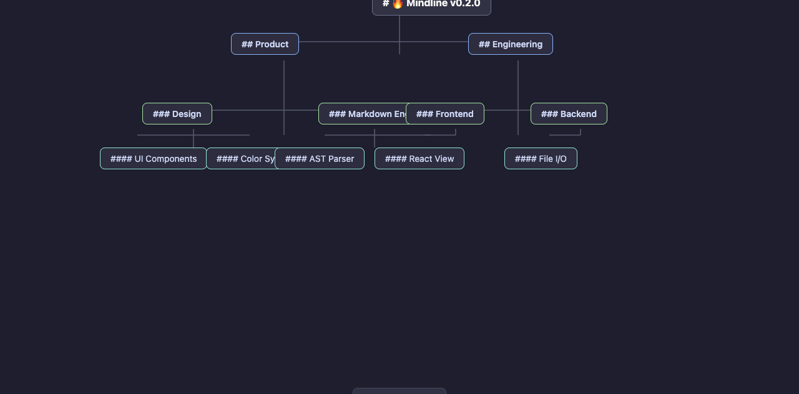

# Mindline

[](https://github.com/zhonxia/obsidian-mindline)
[](LICENSE)
[](https://obsidian.md)

[🇨🇳 中文](README.zh.md) | [🇬🇧 English](README.md)

> A Mubu-style Markdown outline mind map plugin for Obsidian. Visualize and edit your Markdown headings as an interactive mind map.

---

## ✨ Features

### Core

- **📄 Bidirectional Sync** — Markdown file and mind map stay in real-time sync; editing either view reflects instantly in the other
- **✏️ Inline Editing** — Seamless contentEditable-based editing, double-click to enter edit mode with cursor auto-positioned at end
- **🔗 Multi-Select** — `Cmd/Ctrl + Click` for multi-select, `Shift + Click` for range selection, enabling batch operations
- **🧩 Node Merge** — Merge multiple selected sibling nodes into one; titles auto-concatenate, child nodes intelligently appended
- **↩️ Undo/Redo** — `Ctrl+Z / Ctrl+Shift+Z` with up to 50-step history
- **📌 Node Collapse** — Click to collapse/expand child nodes, keeping large mind maps readable

### Interaction

- **🖱️ Drag & Drop** — Drag nodes to reposition and restructure hierarchy
- **🔍 Canvas Controls** — Pan by dragging empty space, zoom via scroll wheel or pinch gesture; bottom toolbar with "Fit Canvas" button
- **⌨️ Full Keyboard Navigation** — Navigate, edit, and delete without touching the mouse
- **🎨 Markdown Rendering** — Supports **bold** / *italic* / `code` / ~~strikethrough~~ in node text
- **🌈 H1-H5 Styling** — Nodes auto-colored by heading level for visual clarity
- **🚌 Bus-line Connectors** — Same-level sibling nodes share vertical bus lines, reducing visual clutter

---

## 📸 Preview



*Mindline mind map view inside Obsidian: H1-H5 auto-coloring, bus-line connectors, zoom toolbar, multi-select highlight.*

---

## 📦 Installation

### From Obsidian Community Plugin Marketplace (pending review)

1. Open Obsidian → **Settings** → **Community Plugins** → **Browse**
2. Search for **"Mindline"**
3. Install and enable

### Via BRAT (Recommended)

Use [BRAT](https://github.com/TfTHacker/obsidian42-brat) for easy installation:

1. Install and enable BRAT
2. Command Palette → `BRAT: Add a beta plugin for testing`
3. Enter repo URL: `https://github.com/zhonxia/obsidian-mindline`
4. Enable **Mindline** in Community Plugins list

### Manual Install

```bash
# Clone to Obsidian plugins directory
cd your-vault/.obsidian/plugins
git clone https://github.com/zhonxia/obsidian-mindline.git
cd obsidian-mindline
npm install
npm run build
```

Then enable **Mindline** in Obsidian **Settings → Community Plugins**.

---

## 🚀 Usage

### Open Mind Map View

1. Open any Markdown note (needs `# Heading` markers to generate a mind map)
2. Click the mind map icon in the left ribbon, or
3. Command Palette: `Ctrl/Cmd + P` → **"Mindline: Toggle mind map view"**

---

### Node Selection

| Action | Method |
|--------|--------|
| Select single node | Click the node |
| Multi-select nodes | `Cmd/Ctrl + Click` |
| Range select | `Shift + Click` under same parent |
| Deselect | `Escape` or click empty canvas area |

Selected nodes show an orange highlight border; multi-selected nodes each display a highlight.

---

### Editing Operations

| Action | Method |
|--------|--------|
| Edit node | Double-click / `F2` / `Enter` |
| Add child node | `Tab` |
| Add sibling node | `Enter` (when not editing) |
| Delete node | `Delete` / `Backspace` |
| Merge selected nodes | `Cmd/Ctrl + M` (multi-select first) |
| Drag to move | Hold and drag node to target |
| Collapse children | Click the collapse button `▾` |

---

### Keyboard Shortcuts

#### Editing

| Shortcut | Function |
|----------|---------|
| `Tab` | Add child node to selected node |
| `Shift + Tab` | Outdent (move node up one level) |
| `Enter` | Add sibling node after selected |
| `Shift + Enter` | Add child node (same as `Tab`) |
| `Delete` / `Backspace` | Delete selected node |
| `F2` / Double-click | Edit current node |
| `Escape` | Cancel edit / deselect |

#### Navigation

| Shortcut | Function |
|----------|---------|
| `↑` / `↓` | Navigate between sibling nodes |
| `Tab` (during edit) | Confirm edit and exit |

#### Batch Operations

| Shortcut | Function |
|----------|---------|
| `Cmd/Ctrl + Click` | Multi-select nodes |
| `Shift + Click` | Range select nodes |
| `Cmd/Ctrl + M` | Merge selected (same parent) |
| `Cmd/Ctrl + Z` | Undo |
| `Cmd/Ctrl + Shift + Z` | Redo |

---

### Mouse & Trackpad Gestures

| Gesture | Function |
|---------|---------|
| Left-drag empty area | Pan canvas |
| Left-drag a node | Move node to target position |
| Mouse wheel | Zoom centered on cursor |
| Trackpad two-finger swipe | Pan canvas |
| Trackpad pinch | Zoom canvas |

---

### Zoom Toolbar

Floating toolbar at bottom center:

- **`+`** — Zoom in (+10% each step)
- **`−`** — Zoom out (-10% each step)
- **Percentage** — Shows current zoom level; click to reset to 100%
- **`⊡`** — Fit canvas (auto-frame all nodes)

---

## 🎨 Node Styling

Node colors and styles change automatically by heading level:

| Level | Syntax | Style |
|-------|--------|-------|
| H1 | `# Title` | Dark gray border, bold, largest font |
| H2 | `## Title` | Blue border |
| H3 | `### Title` | Green border |
| H4 | `#### Title` | Teal border |
| H5 | `##### Title` | Orange dashed border |
| Plain | No prefix | Light gray border, regular weight |

---

## 🧩 Node Merge

Merge multiple sibling nodes into one — useful for consolidating overlapping or overly fragmented nodes.

### Steps

1. **Select nodes** — `Cmd/Ctrl + Click` or `Shift + Click` to select multiple siblings
2. **Trigger merge** — `Cmd/Ctrl + M`, or right-click → "Merge selected nodes"
3. **Confirm result** — The first-ordered node is kept; titles of the rest are concatenated; all child nodes are auto-appended

### Rules

- ✅ **Supported**: Multiple nodes under the same parent
- ❌ **Not supported**: Cross-level merge (would break Markdown structure)
- 📝 Merged content = node titles joined with `\n\n`
- 👶 Children of merged nodes are appended at the end of the surviving node's child list
- 🎯 Surviving node is auto-selected after merge

---

## 🔧 Development

```bash
# Install dependencies
npm install

# Development (watch mode, auto-rebuild)
npm run dev

# Type checking
npm run typecheck

# Production build
npm run build
```

Build artifacts: `main.js`, `manifest.json`, `styles.css`, `versions.json`

---

## 🏗️ Tech Stack

| Technology | Purpose |
|-----------|---------|
| **TypeScript 5** | Strict-mode type safety |
| **React 18** | Hooks + functional components |
| **Esbuild** | Fast bundling (~1s builds) |
| **mdast** | Markdown AST parsing & serialization |
| **Obsidian API** | Plugin lifecycle, editor integration |

---

## 🗺️ Roadmap

- [x] Multi-select & node merge
- [x] contentEditable inline editing
- [x] View state persistence
- [ ] Settings panel (custom styles, shortcut mapping)
- [ ] Export to PNG / SVG
- [ ] Multi-file mind map linking
- [ ] Node search & filter
- [ ] Connector line style options (curve/straight)
- [ ] Node notes & rich text support

---

## 🐛 Feedback

Encountered a bug or have a feature request? Open an [issue](https://github.com/zhonxia/obsidian-mindline/issues).

---

## ❤️ Acknowledgments

- Inspired by [Mubu](https://mubu.com)'s outline mind map experience
- Built on the [Obsidian](https://obsidian.md) plugin API

---

## License

MIT © Qin Bai
